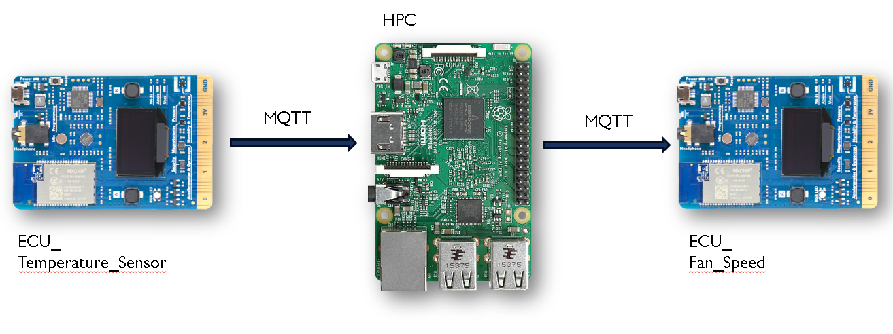

<p align="center" width="100%">

# Abstraction Beyond ThreadX
## By ZXData Labs


</p>

## Target

This is achieved through the following infrastructure components:

1) Communication Framework: A seamless network spanning the controls domain (e.g., ASIL-compliant systems), HPC domain, and extending to the Cloud and Mobile platforms.
2) Unified Data Model: A standardized representation that provides a consistent interpretation of a vehicle, regardless of the underlying E/E architecture.

## Key Focus Areas

Among the two components above, establishing a robust data model (#2) takes precedence. A well-defined schema, structured logically, facilitates the creation of system-level and application-level services, enabling new vehicle functionalities to be developed concurrently with the refinement of the communication framework (#1).

To begin, we will implement a basic communication system supporting publish/subscribe (and request/response) patterns using protocols like MQTT. Once feature development is unblocked, we will revisit this infrastructure for optimization, such as exploring data distribution services with custom serialization for better performance.

## Architecture



## High-Level Implementation Overview

### Transport Abstraction Layer

The transport layer must support state change publications/subscriptions and traditional request/response-based services within the vehicle. While protocols such as MQTT, DDS, NATS, or GRPC can achieve this, the immediate priority is not to finalize the protocol choice. Instead, an abstraction layer will be created, enabling easy future replacement or enhancement of the communication protocol.

### Data Model

The data model acts as an interface definition language to standardize the expected interfaces within the vehicle. It should meet the following criteria:

- Enable publish/subscribe mechanisms for properties.
- Define request/response relationships for services
- Provide organization through namespaces.
- Allow tagging endpoints with attributes like privacy sensitivity or ephemeral status.
- Guarantee forward compatibility, recognizing that cloud and vehicle updates may not align.
- To maintain a consistent representation of a vehicle, the interface definition language must operate within a global namespace. Organizing properties and services thoughtfully ensures clarity and ease of use for developers.

The data model will be structured into at least two layers:

#### ECU Abstraction

This layer isolates E/E architecture details, publishing properties and handling services via RTOS/ASIL-compliant systems. It allows higher-level applications to operate independently of hardware or network specifics. Restrictions such as avoiding repeated fields and limiting payloads to under 1KB may apply due to RTOS constraints.

#### Service Abstraction

This layer provides higher-level functionalities by aggregating ECU Abstraction interfaces across domains. For instance, an HVAC service offering remote climate control may integrate drive mode (e.g., "isParked"), battery status ("hasSufficientCharge"), and climate control settings ("enableHvac") to deliver functionality beyond individual ECU interfaces.

## Usage

### Running the MQTT broker on Raspberry PI

Install mosquitto on Rasperi see [here](https://randomnerdtutorials.com/how-to-install-mosquitto-broker-on-raspberry-pi/)

Run mosquitto with the given config.
```bash
mosquitto -c mosquitto.conf
```

Start the zxData hub.
```bash
python3 zxdata-hub.py
```

Used MQTT topics:
* `ecub/tx` - publish topic of ecub 
* `ecub/rx` - subscribe topic of ecub
* `ecuf/tx` - publish topic of ecuf 
* `ecuf/rx` - subscribe topic of ecuf
	
Used commands with the json data model
* `to_ecub` - send the recieved data to ecub
* `to_ecuf` - send the recieved data to ecuf
		
### ThreadX (Info and challenge)

For more information about ThreadX and the challenge see [here](./TX_challenge.md)
